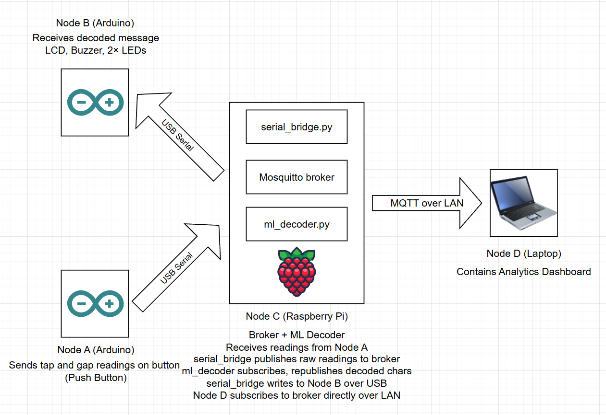

# Morse Code IoT Pager — EE250 Final Project

## Team Members
- Abhigya Goel
- Lucas Kim

## Project Video
[Watch the demo](https://drive.google.com/file/d/1_sY0KilftN7DAvhQmzDbB_iyvcIN2_Tp/view?usp=sharing)

## Overview
A four-node Morse code pager. A user taps Morse code on a pushbutton connected to Arduino Node A. The Raspberry Pi decodes the tap stream in real time using a trained Random Forest classifier and relays the decoded message to Arduino Node B, which displays it on an LCD and plays it back audibly through a buzzer. A laptop runs a Flask dashboard that visualizes the ML inference live.

## System Architecture



| Node | Hardware | Role |
|------|----------|------|
| **Node A** | Arduino Uno R3 | Sender — pushbutton on D2 (INPUT_PULLUP). Computes tap/gap durations via `micros()` and streams `TAP,<us>` / `GAP,<us>` over USB serial. |
| **Node B** | Arduino Uno R3 | Receiver — 16x2 LCD shield (D4-D10), buzzer on D13, LED1 on D2, LED2 on D3. Displays decoded text, plays Morse via buzzer, blinks LEDs (LED1=dot, LED2=dash). SOS triggers a warbling alarm. |
| **Node C** | Raspberry Pi | Runs Mosquitto MQTT broker, serial bridge (reads Node A, writes Node B), and ML decoder (Random Forest inference). Uses `rf_lite.py` for pure-numpy inference — no sklearn needed on Pi. |
| **Node D** | Laptop | Runs Flask-SocketIO dashboard with live Chart.js visualizations. Manual inject panel lets you type text to encode as Morse and send to Node B. |

## Serial Protocol

**Node A -> Pi** (plain text, 115200 baud):
```
TAP,<duration_us>
GAP,<duration_us>
```

**Pi -> Node B** (plain text, 115200 baud):
```
CHAR,<character>          - append character to LCD
TONE,<morse_pattern>      - play Morse on buzzer (e.g. "...", "---")
SOS                       - play warbling alarm tone
RESET                     - clear LCD back to "Waiting..."
```

## MQTT Topics

| Topic | Description |
|-------|-------------|
| `pager/morse/raw/A` | Raw tap/gap events (JSON, from bridge) |
| `pager/morse/raw/A/classified` | Events with ML label + confidence (from decoder) |
| `pager/morse/decoded/<node>` | Decoded character + confidence (from decoder) |
| `pager/alert/<node>` | Tone/SOS commands for Node B (from decoder) |
| `pager/status/<node>` | Node online/offline state |
| `pager/control/reset` | Session reset command (from dashboard) |

## ML Approach

**Model:** Random Forest classifier (100 trees, max_depth=12, class_weight="balanced").

**Features per event (4):**
1. Raw duration (ms)
2. Duration / running session mean (speed normalization)
3. Duration / previous duration (relative ratio)
4. Is-tap flag (1 = tap, 0 = gap)

**Classes:** dot, dash, intra-letter gap, inter-letter gap, word gap

**Training:** Synthetic data generated from realistic Morse sessions. Simulates actual English words at 10/15/20/25 WPM with 15% Gaussian noise. Events processed in natural sequential order so the running session mean matches real-time inference. ~55k samples. Trained on laptop with sklearn, exported to JSON for Pi deployment.

**Inference:** ML model classifies all events. During warmup (first 6 events), fixed thresholds (400ms inter-letter, 1200ms word gap) are used as fallback while the session mean stabilizes. After warmup, the model handles gap classification using session-normalized features. Buffer overflow protection flushes the letter buffer if it exceeds 6 symbols.

## Instructions to Compile/Execute

### 1. Training (laptop, one-time)
```bash
cd training
pip install numpy pandas scikit-learn joblib
python generate_data.py
python train_model.py
```

### 2. Arduino (upload via Arduino IDE on laptop)
- Upload `arduino/node_a/node_a.ino` to Node A Arduino
- Upload `arduino/node_b/node_b.ino` to Node B Arduino
- Connect both to Pi via USB

### 3. Raspberry Pi
```bash
sudo apt install mosquitto mosquitto-clients
pip install paho-mqtt pyserial numpy
cd project/morse-pager/pi
ls /dev/ttyACM*
python3 serial_bridge.py --port-a /dev/ttyACM<A> --port-b /dev/ttyACM<B>
python3 ml_decoder.py    # in a second terminal
```

### 4. Dashboard (laptop)
```bash
cd dashboard
pip install flask flask-socketio paho-mqtt
python app.py --broker <pi_ip_address>
```
Then open [http://localhost:5000](http://localhost:5000).

## External Libraries

| Environment | Libraries |
|-------------|-----------|
| Pi | paho-mqtt, pyserial, numpy |
| Laptop | flask, flask-socketio, paho-mqtt |
| Training | numpy, pandas, scikit-learn, joblib |
| Frontend | Chart.js (CDN), Socket.IO client (CDN) |
| Arduino | LiquidCrystal (built-in) |

## LLM Acknowledgment
Claude Code (Anthropic) was used to assist with code development, debugging, and iterative refinement throughout this project. All design decisions were reviewed and understood by the team.
